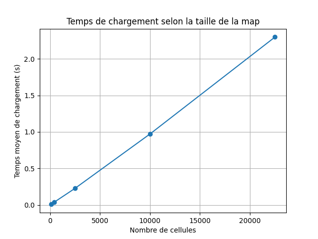
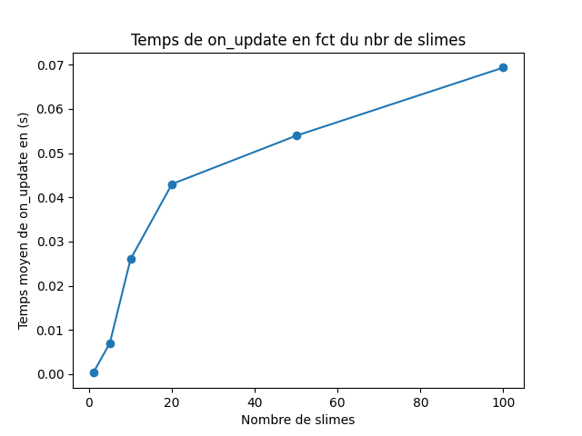

# DESIGN.md

## Vue générale

Notre projet, comme vous le savez sans doute, est un jeu d’aventure 2D développé en Python avec la bibliothèque Arcade. Le joueur se déplace sur une carte chargée depuis un fichier texte, collecte des cristaux, combat des ennemis avec plusieurs armes et interagit avec des interrupteurs qui ouvrent ou ferment des portails.

Nous avons refactorisé le projet (PLUSIEURES fois si je puis dire) pour éviter que toute la logique soit concentrée dans `GameView`. La classe `GameView` reste le point d’entrée principal du jeu, mais elle délègue plusieurs responsabilités à des modules spécialisés :

- `Map` représente la carte de manière abstraite.
- `Player` gère le joueur, ses déplacements, ses vies et son bouclier.
- `WeaponSystem` gère les armes.
- `EnemySystem` relie les ennemis logiques à leurs sprites, et donc centralise la mise à jour des ennemis.
- `CollisionHandler` centralise les collisions.
- `WorldRenderer` centralise l’affichage.
- `navmesh.py` gère le graphe utilisé par les slimes.
- `switch.py` gère les interrupteurs et les portails.

Ce découpage rend le projet plus lisible, plus testable et plus facile à faire évoluer.

---
## Définition du type direction :

Comme `Direction` est supposé représenter les 4 directions cardunales, on a choisi de le représenter par un `Enum`. Cela aide également si jamais on a besoin d'ajouter d'autres directions, on n'aura qu'à les ajouter également dans `Direction` et implémenter leurs commandes associées sans changement de structure globale.

## Définition du joueur :

On a choisi de définir la classe `Player` comme sous-classe de `arcade.TextureAnimationSprite`, simplement parce que c'est un sprite avec une animation, une échelle et une position. Biensur, on ajoute à cela nos attributs définis en particulier pour implémenter nos extensions (vies et bouclier).
Cette classe encapsule donc les données et méthodes propres au joueur, dont sa direction, son déplacement, ses vies, son bouclier... et leur mise à jour par les méthodes correspondantes. On évite de cette façon d'avoir à tout définir dans `GameView`, et le détail d'impplémentation des méthodes reste interne à la classe `Player`, même si on appelle des fonctions de mise à jour dans `GameView`. Par exemple, la question de design qui nous avait été posée à la conception concernait la lecture des touches du clavier, et bienque `GameView` en reste responsable, la logique du mouvemet est déléguée à `Player` avec `update_movement()` en lui passant des booléens selon la direction du mouvement. Cette implémenation permet en plus de mieux structurer nos tests (indépendamment de arcade), de gérer des cas comme "deux touches opposées en même temps"; pour plus de détails, voir le corps de la méthode.

## Gestion des armes :

Au début, nous avions conçu une classe `Boomerang` héritant directement de `arcade.TextureAnimationSprite`, de même pour l'épée, on avait similairement défini une classe `Sword`. Ce n'est que bien plus tard, après plusieurs refactorisations qu'on on en est arrivé au format actuel : `Weapon` et `WeaponSystem`.
`Weapon` est une classe abstraite commune aux deux armes, elle hérite de `arcade.TextureAnimationSprite`, donnant donc aux armes une animation, position, et échelle, en plus de l'attribut supplémentaire `direction`, responsable comme son nom l'indique, de la direction des armes. La classe définit donc une interface commune avec des méthodes abstraites: `is_active` et `deactivate`, garantissant ainsi la bonne coordination entres les armes en fonction de leurs états respectifs, et ce malgré leur différences de comportements. Viennent ensuite les classes `Boomerang` et `Sword` héritant toutes deux de `Weapon` mais implémentant leur propre logique. En discutant tous deux, on s'est dit qu'on aurait pu mieux concevoir ces deux classes pour mieux implémenter la logique des deux armes, mais faute de temps, on laisse `WeaponSystem` gérer tout ça (nous parlons des méthodes comme `_update_sword`...). Avant de passer à `WeaponSystem`, on regarde d'abord comment on a représenté les états des armes, `BoomerangState` est un Enum pour les 3 états, et dans le même esprit `SwordState` représente les deux états du sword. On aurait pu utiliser un booléen à la place, mais `SwordState` en tant que tel donne une meilleure compréhension.
Enfin, la classe `WeaponSystem` centralise toute la gestion des armes, elle sert d'intermédiaire entre `GameView` et les armes, de cette façon, `GameView` n'a pas besoin de connaître les détails internes de l'épée et du boomerang, elle appelle simplement les méthodes appropriées pour décider quelle arme utiliser, met à jour son animation, gère ses collisions et synchronise sa position avec le joueur.

## Gestion des ennemis :
Enfin nous en avons terminé avec les armes ! Mais on n'est pas au bout du chemin... Il est maintenant autour d'une autre entité majeure au sein de notre projet, à savoir : les ennemis. Comme pour les armes, on avait au début conçu des classes indépendantes pour chaque ennemi, toutes héritant directement de `arcade.TextureAnimationSprite`. C'est à l'ajout du slime avec 3 ennemis qu'on s'est rendu compte d'à quel point il était pénible de tout reprendre depuis le début, d'où la classe abstraite commune : `Enemy`. Tous les monstres héritent de cette classe qui elle même hérite de `arcade.TextureAnimationSprite`, cela nous permet de construire nos ennemis avec une animation, une échelle et une position. Les méthodes abstraites implémentées dans chaque sous classe sont : `update_logic` et `sync_sprite`, et ici encore je dirais que c'est un point fort de notre design, car on sépare la logique du comportement des monstres de leur représentation visuelle, et c'est cette dernière fonction qui lie les deux. `update_logic` met quant à elle à jour la logique de chaque monstre suivant ses caractéristiques, et c'est de là qu'est née une nouvelle classe : `EnemyContext`. Quand on utilisait `**kwargs` pour les arguments supplémentaires de `update_logic` (oui, c'était un premier choix), on obtenait des avertissements de typage, on a donc refactorisé en créant cette nouvelle classe qui prend en compte ce dont les ennemis pourraient avoir besoin (donc le contexte du jeu, d'où le nom). Si jamais un autre ennemi que ceux définis est ajouté, et qu'il a besoin d'un autre paramètre, il suffit de le rajouter aux attributs de `EnemyContext` et de l'initialiser dans `GameView` au moment de l'update. Pour chacune des sous-classes : `Bat`, `Spinner`, `Slime`, on définit leur méthodes propres de mises à jour en fonction de leurs caractéristiques, ces méthodes seront ensuite appelées par `update_logic()`.
Chacun des monstres ayant sa propre logique de déplacement, on a définit plusieures fonctions différentes pour gérer cet aspect. Ainsi, on garde l'aspect semi-aléatoire du mouvement des chauves-souris à l'intérieur d'un rectangle, on garde les aller-retour linéaires des spinners, et bien sur, comment oublier les slimes avec leur code PLUS que compliqué (navmesh, suivre le joueur...). La remarque que nous nous sommes faites concerne principalement les fonctions `create_enemy`(avec enemy soit chauve-souris, slime ou spinner). Une refactorisation serait clairement envisageable pour les regrouper peut être comme méthode abstraite de la classe parent. Si d'ailleurs on y parvient d'ici vendredi, vous le verrez bien. Enfin, parlons de `EnemySystem`. On y centralise la gestion globale des monstres au lieu de laisser GameView s'en charger directement.(je crois bien que c'est mentionné dans un commentaire, mais c'est littéralement le "miroir" de WeaponSystem). De cette façon, `GameView` ne connait pas les détails d'implémentation des ennemis, c'est à `EnemySystem` de mettre à jour les animations, le déplacement et les collisions. C'est aussi un point dont on est honnêtement plutôt fiers.

## NavMesh
Avant de passer aux collisions, parlons d'un des titans de notre programme  `NavMesh`. Que dire de cette classe si ce n'est que nous avons (excusez le langage familier) GALÉRÉ, à la coder, SURTOUT à l'introduction de `FINESSE` (c'était néanmoins très intéressant de voir l'évolution de notre code petit à petit en implémentant TW : dijkstra). `NavMesh` représente une zone de la carte sur laquelle le slime peut se déplacer. Il sert principalement à calculer le chemin accessible du slime. Son attribut est un graphe pondéré, composé de noeuds et d'arêtes reliant certains de ces noeuds. Le noeud est représenté par le type `Node` qui est en réalité un `tuple[int,int]` ce qui est tout à fait approprié. Pourquoi ? car un noeud est essentiellement une position dans la grille, donc le tuple correspond simplement à ses coordonnées dans celle-ci, et surtout comme demandé, c'est un type hashable.
Si au début le noeud représentait une case de la map, à l'introduction de `FINESSE`, chaque noeud représente une 'sous-case' de celle-ci. En effet, on découpe la grille en `FINESSE`**2 sous-cases, et si l'une de ces dernières est trop proche d'un buisson, on l'exclu du graphe. Ainsi, les sous-cases accessibles deviennts : celles qui ne sont pas un buisson, ni un trou ou un portail, ni trop proches d'un buisson. Ces sous-cases sont donc récupérées en noeuds, et sont reliés entre eux par une arête qui a un coût correspondant à la distance euclidienne entre eux, permettant donc a dijkstra de vraiment choisir le chemin le plus court. Par la suite, grâce à la fonction `shortest_path`on trouve le noeud le plus proche de la position du slime, on trouve le noeud le plus proche du joueur, et on applique dijkstra entre ces deux points. On obtient alors la liste de points `Point` en pixels, qui correspond aux point que le slime suivra. On a tout de même pris un peu de liberté (un tout petit peu) en ajoutant une distance à partir de laquelle le slime ne part plus en navmesh, mais plutot va en ligne droit sur le joueur. Comme la fonction `_move_directly_to` était déjà défini, on s'est dit qu'il était plus optimal d'intégrer cette condition pour éviter un recalcul de dijkstra alors qu'on est déjà assez proche du joueur (en plus, il faut dire que ça rend le jeu plus intéressant).

## gestion des collisions:
À présent, il me semble naturel après avoir introduit toutes les entités majeur, de parler de leurs interactions, et donc des coklisions. La classe `CollisionHandler` gère toutes les collisions du jeu au lieu de laisser `GameView` s'en occuper directement. C'est également un aspect dont on est vraiment fier, car pour penser à centraliser la gestion des collisions ce n'était vraiment pas une partie de plaisir. Bref, on centralise donc : les collisions du joueur vs ennemis et cristaux, armes vs ennemis, crytsaux vs armes, vous voyez le tableau. Le rôle de cette classe est de détecter les contacts entre les entités principales du jeu (joueur, ennemis, armes, objets), et d'appeler les méthodes appropriées. C'était tout de même quelaue chose de penser à ses attributs, et c'est probablement l'un des aspects du jeu qui nous a pris le plus de temps. Les `Callable` étaient des modifications très récentes et on était très content d'utiliser des concepts directs du cours. Le choix de cette classe évite les énormes blocs de code dans `GameView` qui délègue la gestion des collisions à `WeaponSystem`, ce qui n'est possible que grâce à `CollisionHandler`.

## dessin du monde :

On a déjà centralisé la plus part des aspects du jeu, pourquoi ne pas le faire également pour l'affichage. C'est donc là qu'intervient le rôle de `WorldRenderer`. De cette façon, `GameView` ne gère pas directement la partie visuelle et on évite les grands blocs de code. `WorldRenderer` s'occupe de dessiner les éléments de notre monde, son rôle n'est pas de décider de l'évolution du jeu, mais uniquement de le représenter visuellement. On revient donc à nouveau à la phrase mentionnée plus haut : on a séparé l'aspect visuel grâce à `WorldRenderer` de l'aspect logique avec les classes mentionnées plus haut. Alors, au moment du dessin, `GameView` appelle simplement les méthodes appropriées de `WorldRenderer`.

## Interrupteurs et portails:
Pour les interrupteurs et les portails, on a encore une fois, par choix de design, séparé la logique de la configuration en créant `switch.py`. Si la map contient les informations abstraites venant du fichier YAML (les interrupteurs, portails, conditions...), `switch.py` quant à lui transforme ces configurations en vrais objets du jeu avec nos classes Switch et Gate. Définissions donc le `Switch`: il contient son identifiant, sa position, son état, et aussi un booléen `is_being_hit` (nécessaire pour éviter plusieurs mises à jour de son état, car une arme peut bien le "frapper" pendant plusueirs frames). On a donc choisi de considérer qu’un switch ne peut être re"frappé" qu’après que l’arme se soit éloigné.
Pour les portails, on utilise une classe `Gate` (pkus ou moins mirroir de `Switch` ) qui garde sa position, sa condition d’ouverture et son état actuel. Son état n'est bien évidemment pas laissé au hasard, il dépend biensur de sa condition logique et de l'état des interrupteurs.  S'ajoutent à ceci les fonctions `switch_states()` et `update_gates()` qui permettent justement de recalculer proprement ces états. On peut biensur défendre ce choix de design, bien que ce ne soit pas le meilleur. En effet, `switch.py`va gérer les objets logiques, donc les portails et les interrupteurs, dans `map.py` on se contente de lire les confgurations de chacun, tandis que `GameView` ne fait que créer les sprites et synchroniser, on peut ainsi tester l'évaluation des conditions et les mises à jour indépendament d'acrade !

## Conditions :
Vous avez certainement remarqué qu'on parle depuis tout à l'heure de conditions d'ouverture sans pour autant définir cela, c'est parce que leur tour arrive enfin. On a donc choisi de les représenter avec une petite suite de classes, l'inspiration venant très clairement tout droit du cours (les ADT), et surtout du Final 2025. On retrouve donc des classes comme `SwitchIsOn`, `GateCondition`, `AndCondition`, `OrCondition` et `NotCondition`, qui représentent chacune une formule logique particulière (inutile de les dire explicitement, leur nom l'indique CLAIREMENT) Chaque condition possède une méthode evaluate qui est définie dans la classe abstraite `GateCondition`, et dont tout le reste hérite et est forcé de la définir proprement, en prenant les états actuels des interrupteurs et en renvoyant un booléen qui évalue la condition d'ouverture : True si elle est réalisée, False sinon. Cette façon nous honnetement charmé, car elle appelle récursivement la méthode `evaluate()` de chaque condition, et on s'arretera toujours car à la fin il faut absolument tomber sur une condition du type `SwitchIsOn` (voyez les implémentations des classes pour plus de détails). Avec ce design, chaque classe est responsable de sa propre logique d’évaluation, ce qui évite les énormes blocs de if imbriqués un peu partout. Toutefois, ce design n'est pas infaillible car on aurait préféré définir tout ceci non pas dans `map.py` mais dans `switch.py` pour etre cohérents avec nos choix d'architecture, mais comme cela créait des imports circulaires et des échecs de `ty`, on a présérvé la structure actuelle.
## Map et YAML :
On a beaucoup parlé de la map, mais il reste toujours quelques notions à préciser. Premièrement, remarquez que la map n'est pas une liste de sprites ou je ne sais quoi, mais bien une véritable structure de données (pas étonnant me diriez-vous, on était orienté vers ce choix lors de la semaine 3...). Bref, la classe `Map` décrit donc le monde en stockant ses dimensions, la position de départ du joueur, les cellules de la grille lue et bien sur les interrupteurs et portails. Par ailleurs, on définit également dans le fichier `map.py` des fonctions de lecture de fichiers textes. Ce sont réellement ces fichiers qui contiennent les informations nécessaires à la construction de notre partie de jeu, on est donc bien obligé de les lire. Cette lecture commence dans `main.py` comme vous nous avez demandé. Une fois le programme lancé, on regarde si l’utilisateur a donné un chemin de map dans les arguments du terminal, le cas échéant, on charge ce fichier et on se charge de le traduire, sinon on prend maps/map1.txt par défaut. Ensuite, c'est la fonction `map_from_file()` qui est appelée afin d'ouvrir le fichier et lire son contenu. Ce contenu est alors transmis à `map_from_string()` qui représente la classe prolétaire (en gros elle fait tout le travail). Il y'a un certain nombre de conditions que ce fichier est censé respecter qu'on ne détaillera pas, car vous les connaissez certainement. Honnêtement, il n'y a pas grand chose à justifier en terme de design ici, j'ai donc complété avec des détails d'implémentation car on était orienté par les instructions du projet dans la plus part de nos choix. La seule chose qu'on pourrait dire c'est justifier la définition du type `YAMLValue`. C'est parce qu'on avait des erreurs de type quand on utilisait `Any` ou `object`, on a alors relu la semaine 7 et on a limité les choix pour ce qui est accepté depuis le YAML.

## gameview:
Enfin, nous en arrivons à la classe maitresse de tout notre projet, `GameView`. Après plusieurs heures de code si ce n'est des jours, on a réussi à réduire le nombre de lignes (initialement bcp trop grand) à environ 300 lignes dans `game_view.py`. Au début, elle gérait absolument tout explicitement (dessins, collisions, mouvements, animations...). Une approche qui, au fur et à mesure qu'on s'avançait, devenait trop difficile à maintenir et à gérer. On a donc opté pour le design actuel, qui cela dit, pourrait toujours être amélioré. La conception actuelle de la classe est donc basée sur un ensemble de systèmes (tous expliqués plus haut), qui sont chacun responsable d'un aspect du jeu. J'aime penser à `GameView` comme le général de l'armée, qui délègue les responsabilités à ses colonels, qui passent les ordres aux commandants, (longue chaine de commande militaire), qui finalement mobilisent leurs soldats. Ainsi, le rôle de cette classe devient de créer les systèmes requis, leur fournir les informations nécessaires, et appeler leurs méthodes au moment opportun. Certaines responsabilités ne peuvent toutefois pas être retirées d'ici, tout comme la elcture des touches au clavier (car liée à arcade), ainsi que le resre des fonctions spécifiques à cette bibliothéque. Je trouve qu'il est répétitif de devoir à nouveau préciser quel système est responsable de quoi, mais si vous avez bien suivi jusqu'ici, ils ont tous été très longuement détaillés plus haut.

## Mot de fin :
Enfin voilà, nous en arrivons à la fin de notre fichier design. Il faut dire que nous sommes tout de même assez fiers de nous et de tout le progrès que nous avons réalisé. Bien évidemment, il y'a pleins d'aspects qui peuvent être retravaillés, mais qu'on ne l'a pas fait soit par manque de temps, ou simplement car on n'y a pas pensé (nous ne prétendons absolument pas à l'exhaustivité). Nous pensons toutefois tous les deux que notre architecture actuelle est très avantageuse, et nous espérons qu'elle est à la hauteur de vos attentes.

## réponses aux auestions de la semaine 11 :

# analyse du chargement de la map :

Pour les questions portant sur l'analyse de performance, on a choisi : le chargment d'une map de taille : n=width*height.
À l'initialisation de gameview, on parcourt toutes les cellules de la map afin de créer les sprites nécessaires (donc herbes, trous, murs...), et on en profite également pour construire le navmesh. C'est cette deuxième partie qui est la plus intéressante, car notre code ajoute un certain nombre de noeuds dépendant de la `FINESSE` qui est enfait ici égale à 3. On ajoute ensuite les arêtes vers les voisins, et comme chaque noeuds a au plus 8 voisins. Ces deux étant constants, il s'en suit que la complexite grossièrement calcule est de l'ordre de O(n) (avec n on rappele, la taille de la map = largeur*hauteur). Voyons ça avec plus de précision :
- on crée le monde visuel dans le `init` de `GameView` en faisant appel a `setup_world`, méthode à travers laquelle on parcourt exactement toute la map grâce aux deux boucles `for` imbriquées. à chaque itération, on lit le type de la cellule, on crée un sprite, on les ajoute à une `SpriteList`. Toutes ces opérations demandent un temps constant, on reste donc dans la complexité : O(n).
- à la création du navmesh, c'est à dire quand `GameView` appelle `create_navmesh` en lui passant comme argument la map de taille n, voilà ce qui se passe :
1. on appelle `add_navmesh_nodes` qui va parcourir toute la map avec deux boucles `for` imbriquées encore une fois. Pour chaque cellule résultant d'une itération, on va créer jusqu'à 9 noeuds. Le nombre total de noeuds s'élève donc au pire à 9n, restant donc dans les limites de O(n).
2. Toutefois, on ne s'arrete pas là. Car pour chaque noeud potentiel, on vérifie sa proximité avec un buisson, et c'est là que ça pourrait dégénérer, car à sa première définition, la fonction `is_too_close_to_bush` parcourait toute la map à chaque fois pour chaque point appelé, élévant donc la complexité à un niveau wow. On a alors mis à jour cette fonction pour ne vérifier que les voisins du point en question, grâce à deux boucles `for` imbriquées qui itèrent 9 fois, donc 9 cases au maximum. On passe donc d'une complexité à l'origine de O(n) à une complexité constante de O(1).
3. On passe à l'ajout des arêtes, tâche de `add_navmesh_edges` qui va parcourir tous les noeuds du graphe avec sa boucle `for` interne. Elle accède ensuite à ses voisins, qui sont au maximum 8. L'ajout des arêtes est donc linéairement proportionnel au nombre de noeuds, d'où une complexité de l'ordre de O(n) encore une fois.

En conclusion, le chargement effectue plusieurs opérations linéaires au nombre de cellules de la map. En additionnant le coût, on tombe donc sur le résultat précédent : O(n).

Voici donc le benchmark du chargement avec son graphe généré par matplotlib.

On voit donc bien que c'est en accord avec notre analyse théorique. Pourquoi ? parce que le temps est linéaire avec la taille de la map en soit. Le temps de chargement évolue donc avec le nombre de cellules.

# analyse de on_update():

Le facteur qu'on a choisi pour cette opération s'est naturellment porté sur le nombre de slimes, car ce sont eux qui vont appeler dijkstra pour calculer leur trajectoire. On va se contenter du cas le plus couteux : recacul de la trajectoire.
Si on appelle m le nombre de slimes, alors on sait que `on_update()` de `GameView` appelle `self.enemies.update(context)` de EnemySystem, qui parcourt tous les slimes avec une boucle `for`, et met à jour leur logique, et c'est cette mise à jour logique qui nous intéresse. Mais déjà jusqu'ici, on a O(m) de slimes qui sont mis à jour à chaque frame ! Ensuite, dans le pire des cas, on devra recalculer leur chemin à tous. On recalcule le chemin d'un slime vers sa nouvelle destination avec dijkstra grace à `recompute_path(navmesh)` qui elle même appelle `shortest_path`, une opération dépendant elle même de la longueur du graphe du navmesh car elle appelle `nearest_node` appelant un `min` sur tous les neouds du graphe. Avec un graphe (comme dans ce qui est donné dans le site du projet) G=(V,E), notons V le cardinal de V, comme les arêtes sont construites à partir de V, leur nombre est proportionnel à celui des noeuds. Sachant que la complexité classique de dijkstra pour un tel graphe est O((V+E)log(V)), il s'en suit en remplaçant qu'elle est de l'ordre de O(2Vlog(V)), et donc de l'ordre de O(Vlog(V)). Or, on sait que V sera nécessairement inférieur à la taille de la map*9, supposons donc dans le pire des cas qu'il soit de l'ordre de O(n). On retrouve donc en remplaçant à nouveau : O(nlog(n)). Le coût total en considérant donc le nombre de slime s'élève finalement à O(m * (nlog(n))). On voit que c'est tout de même beaucoup, d'où l'ajout de `DIRECT_CHASE_DISTANCE` pour poursuivre directement le joueur, sans repasser par navmesh si on en est assez proche !

Remarque très important : on a effectivement analysé le pire de cas, mais avec les slimes qui sont des entités très complexes de notre jeu, on a obtenu des résultats plutôt différents, car la réalité n'est pas forcément toujours 'pire des cas'. Honnêtement, on n'a pas trop su comment générer ce pire des cas vu la complexité des slimes... le fichier du benchmark deviendrait trop chargé. Mais svp gardez en tête que les slimes ne sont pas obligés de recalculer leur chemin avec dijkstra à chaque frame, notre analyse n'est donc pas nécessairement fausse (en tout cas, je l'espère...).

en théorie, puisque la taille de la map reste constante et que c'est le nombre de slimes qui changent, d'après la complexité analysée plus haut, on aurait du avoir un graphe linéaire plus ou moins... Mais comme expliqué dans la remarqye, ce n'est pas le cas car le pire des cas n'est pas forcément atteint à chaque frame.
